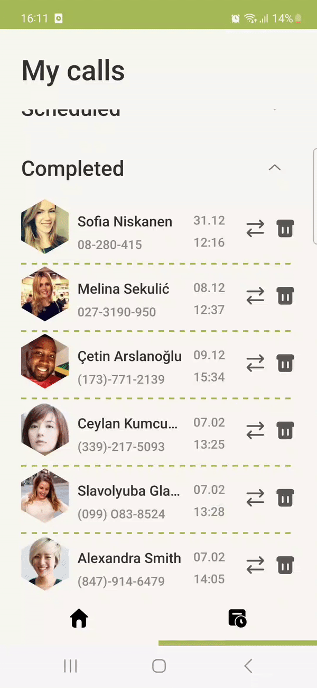

# Fake Calls

Allows to schedule a fake call at specified time.

## Functions:
1. Schedule a call:
- From suggested contact (loaded from [api](https://randomuser.me/))
- From contact selected from phonebook ("more" button)
- From custom contact ("custom" button)
2. For a scheduled call:
- Delete call
- Edit call
3. For a completed call:
- Delete call
- Repeat call

Stack:
- MVVM + MVI
- Jetpack Compose
- Room
- Retrofit
- Coroutines + Flow
- Hilt
- Fastlane(build+test)
- Navigation component

## Scheduling a call

## Receiving a call

